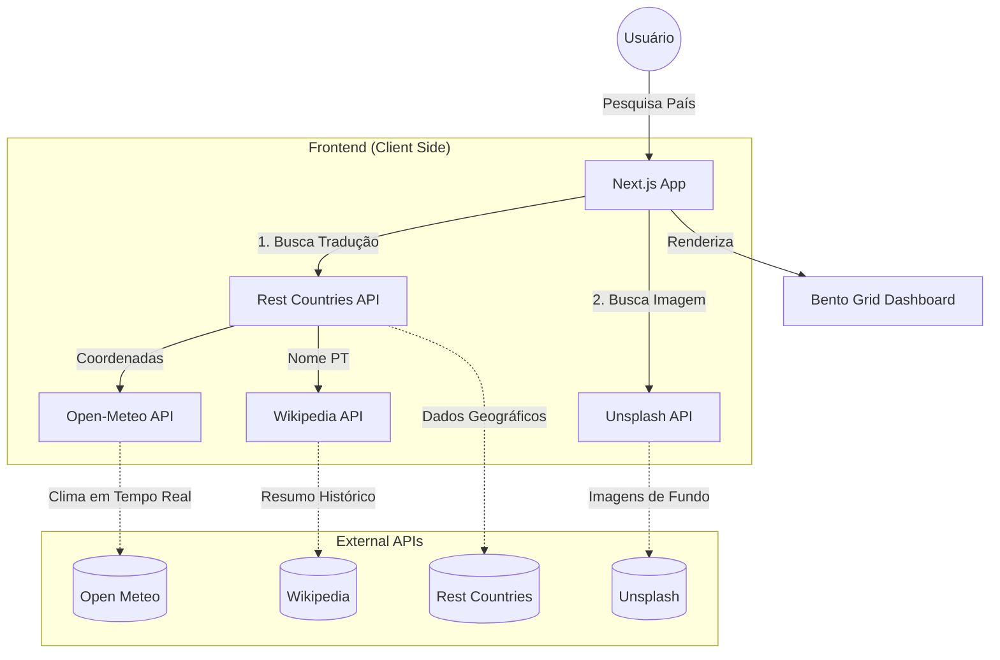

# 🌍 World Explorer

Uma aplicação interativa e imersiva para exploração de dados globais. O projeto busca exibir informações detalhadas de países, integrando dados geográficos, meteorológicos e históricos em tempo real com uma interface futurista e responsiva.

## 🚀 Tecnologias Utilizadas

*   **Framework:** [Next.js 13+](https://nextjs.org/) (App Router)
*   **Linguagem:** [TypeScript](https://www.typescriptlang.org/)
*   **Estilização:** [Tailwind CSS](https://tailwindcss.com/)
*   **Animações:** [Framer Motion](https://www.framer.com/motion/)
*   **Ícones:** [Lucide React](https://lucide.dev/)
*   **Requisições:** [Axios](https://axios-http.com/)

## ✨ Funcionalidades

*   🔍 **Busca Inteligente:** Pesquisa de países com suporte a tradução automática.
*   🖼️ **Dynamic Background:** Alteração dinâmica do fundo da tela com imagens de alta resolução baseadas no destino pesquisado (Unsplash API).
*   📊 **Bento Dashboard:** Visualização organizada de dados como população, moedas, idiomas, capitais e fusos horários.
*   🌦️ **Clima em Tempo Real:** Integração de coordenadas geográficas para buscar temperatura e vento locais via Open-Meteo.
*   📖 **Resumo Histórico:** Extração de dados enciclopédicos diretamente da Wikipedia API.
*   🎨 **Experiência Fluida:** Animações de entrada (*stagger children*) e transições de estado suaves.

## 📦 APIs Integradas

1.  **Rest Countries API:** Dados gerais sobre os países.
2.  **Open-Meteo API:** Dados meteorológicos baseados em latitude/longitude.
3.  **Unsplash API:** Imagens contextuais de fundo.
4.  **Wikipedia API:** Resumos biográficos e históricos.

## 📋 Pré-requisitos

*   Node.js 18.x ou superior
*   NPM, Yarn ou PNPM

## 🔧 Instalação e Execução

1.  **Clone o repositório:**
    
```bash
    git clone "https://github.com/FernandoMoreti/Project-University-WebSite"
    cd Project-University-Website
```

2.  **Instale as dependências:**
    ```bash
    npm install
    # ou
    yarn install
    ```

3.  **Inicie o servidor de desenvolvimento:**
    ```bash
    npm run dev
    # ou
    yarn dev
    ```

4.  **Acesse no navegador:**
    Abra http://localhost:3000 para ver o resultado.

## 🏗️ Arquitetura do Sistema

A aplicação segue uma arquitetura de **Client-Side Data Fetching**, onde o navegador do usuário coordena múltiplas requisições assíncronas para compor o dashboard em tempo real.



## 🏗️ Estrutura de Código

O projeto utiliza **Client Components** para gerenciar múltiplos estados assíncronos:

*   **Layout:** Grid responsivo utilizando `md:grid-cols-3` e `lg:grid-cols-4`.
*   **Animações:** Configurações de `variants` para efeitos de *stagger* (cascata) nos cards.
*   **Resiliência:** Tratamento de erros para APIs que podem falhar individualmente (como Clima ou Wikipedia) sem interromper a exibição dos dados principais do país.

---

## LINK PROJETO

https://project-university-web-site.vercel.app/
Desenvolvido por Fernando Moreti
